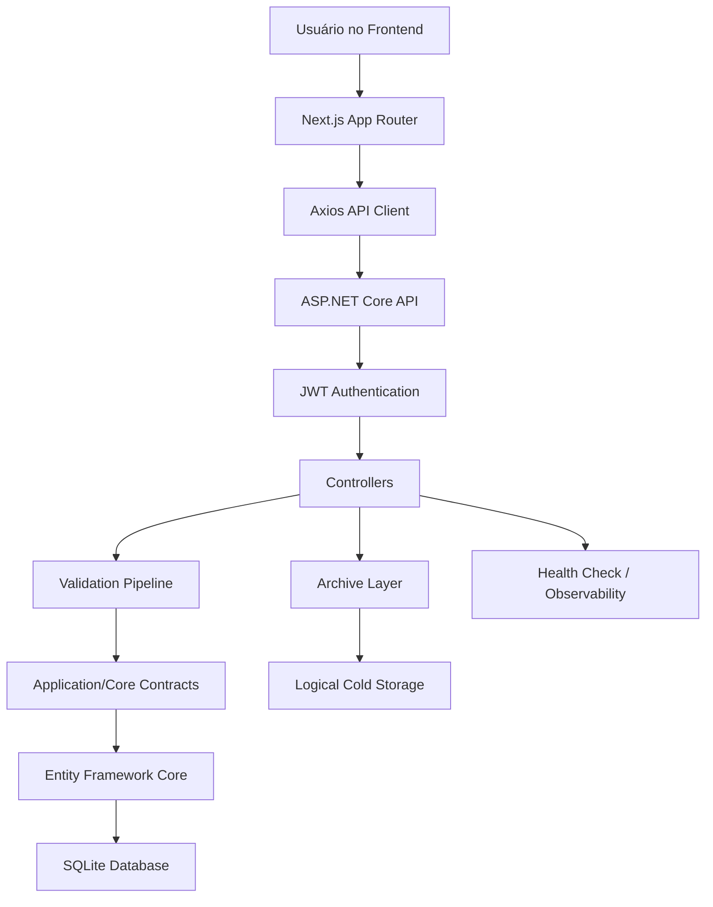

# DeepArchive-Bridge

> Sistema full stack para gerenciamento de vendas com **ASP.NET Core 8**, **Next.js 16**, autenticação JWT, validações, testes automatizados e camada de arquivamento lógico.


**Status:** Em evolução | Base funcional com backend, frontend, testes e pipeline de validação.

---

## Índice

- [Sobre o Projeto](#sobre-o-projeto)
- [Arquitetura](#arquitetura)
- [Fluxo do Sistema](#fluxo-do-sistema)
- [Funcionalidades](#funcionalidades)
- [Stack](#stack)
- [Estrutura do Projeto](#estrutura-do-projeto)
- [Segurança](#segurança)
- [Arquivamento](#arquivamento)
- [Testes](#testes)
- [CI/CD](#cicd)
- [Instalação](#instalação)
- [Variáveis de Ambiente](#variáveis-de-ambiente)
- [Como Executar](#como-executar)
- [Como Validar o Projeto](#como-validar-o-projeto)
- [Destaques Técnicos](#destaques-técnicos)
- [Roadmap](#roadmap)
- [Screenshots](#screenshots)

---

## Sobre o Projeto

O **DeepArchive-Bridge** é uma aplicação full stack criada para gerenciar vendas e demonstrar uma arquitetura moderna com separação clara entre frontend, backend, domínio, persistência e testes.

O sistema permite cadastrar, consultar, editar, aprovar e remover vendas, além de identificar registros antigos por meio de uma camada de arquivamento lógico. Essa abordagem simula uma ponte entre dados ativos e dados históricos, preparando o projeto para evoluir futuramente para uma arquitetura real de **Hot/Cold Storage**.

O projeto foi pensado como uma base de portfólio full stack com foco em:

- Organização de código em camadas.
- Contratos de API com DTOs.
- Validação de entrada.
- Autenticação JWT.
- Testabilidade.
- Experiência moderna no frontend.
- Pipeline de validação para CI/CD.

---

## Arquitetura

O backend segue uma organização em camadas, separando responsabilidades e facilitando manutenção, testes e evolução.

| Camada | Responsabilidade |
| --- | --- |
| **API Layer** | Controllers, autenticação, middlewares, Swagger, CORS e configuração da aplicação. |
| **Core Layer** | Entidades, DTOs, interfaces, opções de configuração e exceções de domínio. |
| **Data Layer** | Entity Framework Core, DbContext, repositórios, migrations e serviços de arquivamento. |
| **Tests Layer** | Testes automatizados de autenticação, vendas, API e comportamento de arquivamento. |

No frontend, o projeto utiliza o **App Router** do Next.js com uma organização voltada para telas, componentes, serviços e tipos compartilhados.

| Área | Responsabilidade |
| --- | --- |
| **App Router** | Rotas principais, páginas de dashboard, vendas, saúde, configuração e arquivamento. |
| **Components** | Componentes reutilizáveis, como formulário de venda e boundary de erro. |
| **Services** | Cliente HTTP com Axios e serviços para vendas, health check e arquivamento. |
| **Types** | Tipos TypeScript alinhados aos contratos da API. |
| **Authentication Flow** | Geração e reutilização automática de token JWT para consumir rotas protegidas. |

---

## Fluxo do Sistema



---

## Funcionalidades

### Gestão de Vendas

- CRUD completo de vendas.
- Cadastro de vendas com múltiplos itens.
- Busca por período, cliente e status.
- Paginação de resultados.
- Aprovação de vendas pendentes.
- Visualização detalhada de venda.

### Segurança

- Autenticação com JWT Bearer.
- Rotas protegidas no backend.
- Geração automática de token para o frontend.
- Middlewares globais para tratamento de erros e controle de requisições.

### Qualidade

- DTOs para proteger contratos da API.
- Validação com FluentValidation.
- Type safety no frontend com TypeScript.
- Testes automatizados com xUnit.
- Script único de validação do projeto.

### Observabilidade

- Health check da API.
- Endpoint simples de ping.
- Dashboard com status operacional.
- Respostas padronizadas com `ApiResponse<T>`.

---

## Stack

| Camada | Tecnologias |
| --- | --- |
| Backend | ASP.NET Core 8, C# 12 |
| Frontend | Next.js 16, React 18, TypeScript |
| Estilização | Tailwind CSS |
| Banco de Dados | SQLite |
| ORM | Entity Framework Core |
| Validação | FluentValidation |
| Autenticação | JWT Bearer |
| Testes | xUnit |
| HTTP Client | Axios |
| CI/CD | GitHub Actions |

---

## Estrutura do Projeto

```text
DeepArchive-Bridge/
├── backend/
│   ├── DeepArchiveBridge.sln
│   └── src/
│       ├── DeepArchiveBridge.API/
│       │   ├── Controllers/
│       │   ├── Middleware/
│       │   ├── Services/
│       │   ├── Validators/
│       │   └── Program.cs
│       ├── DeepArchiveBridge.Core/
│       │   ├── Exceptions/
│       │   ├── Interfaces/
│       │   └── Models/
│       ├── DeepArchiveBridge.Data/
│       │   ├── Context/
│       │   ├── Migrations/
│       │   ├── Repositories/
│       │   └── Services/
│       └── DeepArchiveBridge.Tests/
│           ├── JwtAuthenticationServiceTests.cs
│           ├── TestApiFactory.cs
│           └── VendaControllerTests.cs
├── frontend/
│   ├── app/
│   ├── components/
│   ├── lib/
│   ├── types/
│   ├── next.config.js
│   └── package.json
├── .github/
│   └── workflows/
│       └── ci.yml
├── check.cmd
├── check.ps1
├── NuGet.config
└── README.md
```

---

## Segurança

O projeto possui uma base de segurança pensada para separar dados internos, validar entradas e proteger rotas sensíveis.

- **JWT Authentication:** endpoints de vendas e arquivamento são protegidos por autenticação Bearer.
- **DTO Protection:** controllers recebem e retornam DTOs, evitando exposição direta das entidades internas.
- **Validation Pipeline:** entradas são validadas com FluentValidation antes de executar regras de negócio.
- **Global Exception Handling:** exceções são tratadas em middleware centralizado, gerando respostas padronizadas.
- **Typed API Contracts:** frontend e backend compartilham contratos previsíveis, reduzindo inconsistências.
- **CORS configurável:** origens permitidas podem ser ajustadas via configuração da API.

---

## Arquivamento

A camada de arquivamento identifica vendas antigas, especialmente registros com mais de **90 dias**, e valida sua disponibilidade por meio do serviço de Cold Storage.

Atualmente, o projeto utiliza um **SQLite unificado**. Por isso, o arquivamento lógico não remove registros da base ativa. Essa decisão evita perda de dados enquanto ainda não existe uma separação física entre armazenamento quente e frio.

### Possível evolução para Hot/Cold real

- Banco principal para dados ativos.
- Banco separado para dados arquivados.
- Workers em background para arquivamento automático.
- Jobs agendados.
- Redis para cache.
- Message queues para processamento assíncrono.
- PostgreSQL para ambiente de produção.

---

## Testes

O projeto possui testes automatizados no backend e validações de build/tipo no frontend.

| Área | Cobertura |
| --- | --- |
| Auth | Testes do serviço de autenticação JWT. |
| Vendas | Testes de criação, busca e aprovação de venda. |
| Arquivamento | Teste garantindo que o arquivamento lógico não remove registros. |
| Frontend | Type-check com TypeScript e build de produção do Next.js. |

Para executar a validação completa:

```powershell
.\check.cmd
```

Esse comando executa:

```text
dotnet restore
dotnet build
dotnet test
npm.cmd run type-check
npm.cmd run build
```

---

## CI/CD

O projeto possui workflow de CI com **GitHub Actions** em `.github/workflows/ci.yml`.

Pipeline executado:

1. Checkout do repositório.
2. Setup do .NET 8.
3. Setup do Node.js 20.
4. Restore dos pacotes do backend.
5. Build do backend.
6. Execução dos testes.
7. Instalação das dependências do frontend.
8. Type-check do frontend.
9. Build de produção do frontend.

---

## Instalação

### Pré-requisitos

- .NET SDK 8+
- Node.js 20+
- npm
- Git

### Clonar o repositório

```bash
git clone https://github.com/DanielAzeved0/DeepArchive-Bridge.git
cd DeepArchive-Bridge
```

### Instalar dependências do frontend

```bash
cd frontend
npm install
```

No PowerShell, caso `npm` seja bloqueado pela Execution Policy, use:

```powershell
npm.cmd install
```

### Restaurar dependências do backend

```bash
cd ../backend/src/DeepArchiveBridge.API
dotnet restore
```

---

## Variáveis de Ambiente

### Frontend

Crie um arquivo `.env.local` dentro de `frontend/` se precisar apontar para uma API diferente:

```env
NEXT_PUBLIC_API_URL=http://localhost:5000/api
```

### Backend

As principais configurações ficam em `appsettings.json`.

Exemplo:

```json
{
  "ConnectionStrings": {
    "SQLite": "Data Source=archive.db;Cache=Shared"
  },
  "JwtSettings": {
    "SecretKey": "your_secret_key_with_at_least_32_characters",
    "Issuer": "DeepArchiveBridge",
    "Audience": "DeepArchiveBridgeUsers"
  }
}
```

A API lê `ConnectionStrings:SQLite` e, por compatibilidade, também aceita `ConnectionStrings:DefaultConnection`.

---

## Como Executar

### Backend

```bash
cd backend/src/DeepArchiveBridge.API
dotnet watch run
```

API:

```text
http://localhost:5000
```

Swagger em desenvolvimento:

```text
http://localhost:5000/swagger
```

### Frontend

```bash
cd frontend
npm run dev
```

App:

```text
http://localhost:3000
```

No PowerShell:

```powershell
npm.cmd run dev
```

---

## Como Validar o Projeto

Validação completa:

```powershell
.\check.cmd
```

Comandos individuais:

```bash
dotnet test backend/src/DeepArchiveBridge.Tests/DeepArchiveBridge.Tests.csproj
```

```bash
cd frontend
npm run type-check
npm run build
```

No PowerShell:

```powershell
npm.cmd run type-check
npm.cmd run build
```

---

## Destaques Técnicos

- Clean architecture em camadas.
- API-first design.
- JWT authentication flow.
- DTO-based contracts.
- Global validation pipeline.
- Centralized exception handling.
- Typed frontend contracts.
- CI-ready workflow.
- Automated tests.
- Health check e monitoramento básico.
- Separação clara entre domínio, infraestrutura e interface.

---

## Roadmap

### Concluído

- CRUD de vendas.
- Autenticação JWT.
- Dashboard.
- Health check.
- Arquivamento lógico.
- DTOs para contratos de API.
- Testes automatizados.
- Script de validação local.
- Workflow de CI.

### Próximas melhorias

- Docker support.
- Deploy completo de frontend e backend.
- PostgreSQL para produção.
- Bancos separados para Hot/Cold Storage.
- Background workers para arquivamento automático.
- Redis cache.
- Message queues.
- OpenTelemetry.
- Testes end-to-end.
- Melhorias de UI/UX.

---

## Screenshots

Sugestões de imagens para adicionar ao README:

- Dashboard principal.
- Listagem de vendas.
- Formulário de venda.
- Detalhes da venda.
- Tela de arquivamento.
- Health check.

```md


```

---

## Autor

Desenvolvido como projeto full stack para demonstrar arquitetura, boas práticas, validação, autenticação, testes e integração entre frontend moderno e backend .NET.
